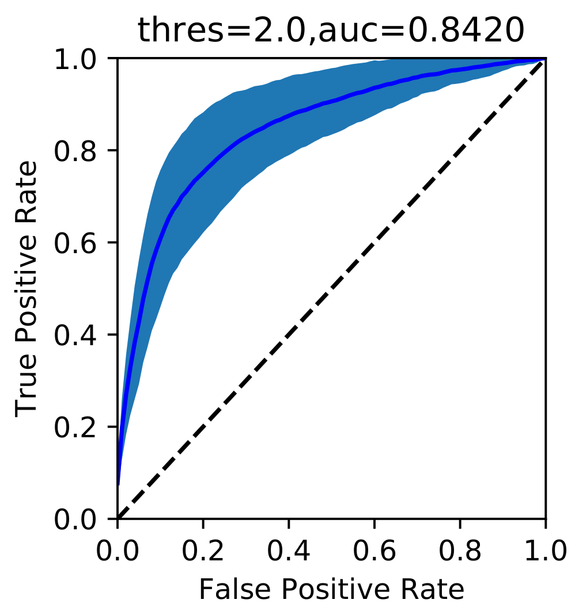

Data-driven inference of protein structure
==============================================

Introduction
-----------------------------
This work was designed to develop an data-driven approach to infer the residue interactions from protein sequences and then predict 3D protein structure.

